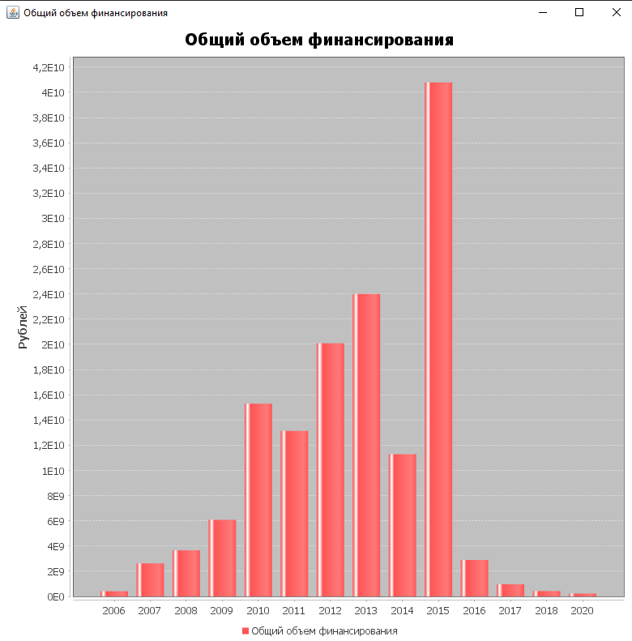

<h1>Java. Основы программирования на РТФ.</h1>
<h2>Вариант 8 Спортивные учреждения</h2>
<h3>Работу выполнил: Коновалов Павел Сергеевич АТ-01</h3>
<ol>
  <li>Был создан класс <b>sportsFacility</b>, с необходимым составом полей и методов для хранения и обработки всех данных, хранящихся в CSV-файле</li>
  <li>Создан класс <b>ImportAndCheck</b>, в котором реализуется метод <b>CreateTable</b>, парсящий CSV-файл, а после создающий базу данных 
  с таблицей наполененой данными из коллекции List«sportsFacility» facilities</li>
  <li>Создан метод <b>FirstTask()</b> внутри <b>ImportAndCheck</b>, который отправляет SQL-запрос в базу данных, возвращая DefaultCategoryDataset. 
  Dataset используется в классе <b>Main</b> для построения гистограммы, на основе полученных данных</li>
  <li>Создан метод <b>SecondTask()</b> внутри <b>ImportAndCheck</b>, который отправляет SQL-запрос в базу данных, 
  данные складываются между собой и делятся на количество этих данных, полученное значение выводится в консоль</li>
  <li>Создан метод <b>ThirdTask()</b> внутри <b>ImportAndCheck</b>, который отправляет SQL-запрос в базу данных, полученные данные сразу выводятся в консоль</li>
  </ol>
  

  

  

